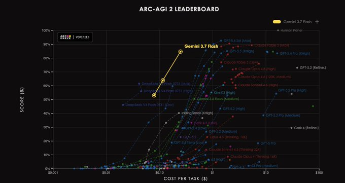
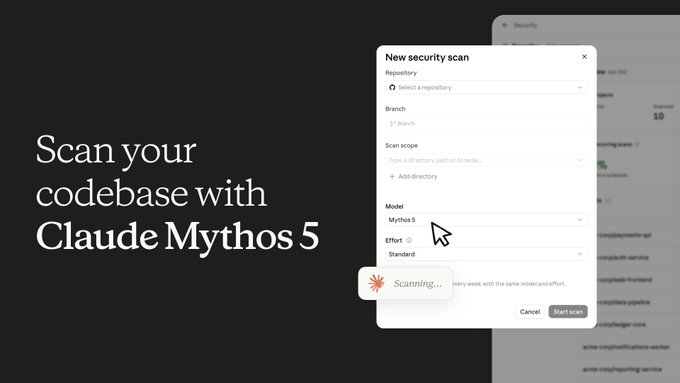
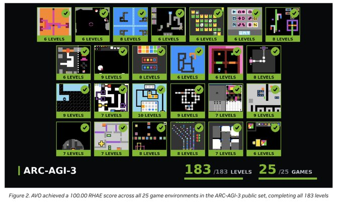
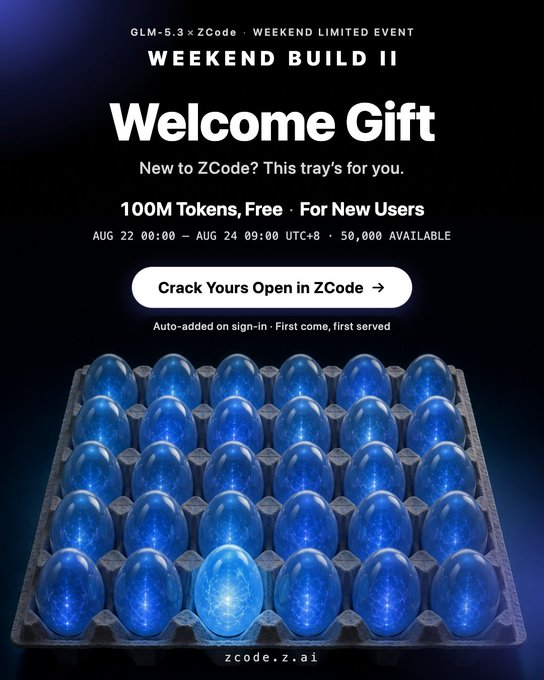

# OpenAI Sol 降价超 20%，Grok、Gemini 等 11 条更新

未来三个月，GPT-5.6 Sol 的 API 与积分价格将下调超过 20%。Grok Bot 扩大试用范围、Gemini 3.7 Flash 进入 Search，Claude、Runway、Firecrawl 等也有新动作。

## 01｜OpenAI Sol：未来三个月 API 与积分价格下调超 20%

OpenAI 将把 GPT-5.6 Sol 的 API 和积分价格下调超过 20%，降价窗口为未来三个月。购买的 token 在 Codex 按 token 计费计划中可使用更久，订阅中原有的包含用量不变。

## 02｜Grok Bot 扩至更多套餐，并开放免费试用

Grok Bot 已扩展到更多套餐，并开始提供免费试用。SuperGrok Plus、Cursor Pro+、Cursor Teams 等用户已可使用；此前仅面向 Heavy 用户的范围也在继续扩大。

## 03｜Gemini 3.7 Flash 首周增长破纪录，已部署到 Search 和应用

Gemini 3.7 Flash 上线第一周打破此前 Gemini 的增长纪录，成为迄今增长最快的 Gemini 模型。它目前已在 Google Search 与 Gemini 应用中运行。

## 04｜Ox Alpha 以免费百万 Token 上下文引发讨论

Ox Alpha 提供免费 100 万 token 上下文和多模态能力，并表示不会使用用户数据训练。它与 GLM-5.3 Flash 的关联及评测表现仍有不同说法，尚未获得官方确认。

## 05｜ChatGPT 的 banked reset 向付费 Work 和 Codex 用户推出

ChatGPT 的 banked reset 已正式推出，覆盖所有付费 ChatGPT Work 与 Codex 用户。该功能在太平洋时间晚上 8 点上线；目前尚未公布具体交互规则。

## 06｜Claude Security 以 Mythos 5 扫描代码库，Enterprise 公测开启

Claude 推出 Claude Security 代码安全扫描服务，可自动给出补丁建议。扫描运行在 Claude Mythos 5 上，现向所有 Claude Enterprise 客户开放公测；扫描代码库不需要另行取得模型访问权限。

## 07｜Inkling 登陆 OpenRouter，Agentic 框架内可免费使用

Inkling 将在未来几周通过 OpenRouter 免费开放，但仅限在 agentic harnesses 中使用。Inkling 与 Inkling Small 可在 Claude Code、Codex、Hermes Agent 等框架中使用，支持文本、图像、音频输入和 100 万 token 上下文。

## 08｜NVIDIA AVO 在 ARC-AGI-3 公共集完成 183 个关卡

NVIDIA AVO 在 ARC-AGI-3 的 25 个公开游戏中取得 100% 成绩，解完 183 个关卡。系统不直接接收规则或明确目标，而是通过尝试、观察结果和纠错学习，并结合持续记忆、工具调用与执行反馈完成任务。

## 09｜Runway Ruby 支持把视频转换为最高 16-bit HDR

Runway 发布 Ruby，支持将 SDR 视频转换为最高 16-bit HDR，输出可选 ProRes 或 EXR 序列，适用于上传视频及最长 30 秒的生成内容。Ruby 已向 Max 计划和企业版开放，也支持 10、12-bit ProRes、HEVC、BT.2020 色彩空间以及 PQ 或 HLG。

## 10｜Firecrawl Developer Index 收录 7000 万+代码与技术资料

Firecrawl 发布 Developer Index，面向编程代理检索超过 7000 万个代码仓库、文档和 issue 等数据源。索引覆盖 README、Issue、已合并 PR、官方文档和 OpenAPI 规范，多数来源会在发布后一天内进入。

## 11｜Codex 性能更新：加载时间由 27.6 秒降至 1.7 秒

Codex 的加载时间从 27.6 秒降至 1.7 秒，超长对话的处理能力也同步提升。

## 12｜GLM-5.3 聚焦代码与网络安全，Z.ai 同步推出新用户赠送额度

GLM-5.3 聚焦代码和网络安全，相比前代提升质量并降低 token 消耗。Z.ai 将 Build Week 延长为长期开放活动，并在 8 月 23 日 18:00（PT）前为前 50,000 名新 ZCode 用户每人提供 1 亿免费 GLM-5.3 token。Ox Alpha 与该模型的关联尚未获官方证实。

信息整理自 X 榜单赛道榜及其聚合的公开 X 帖。
